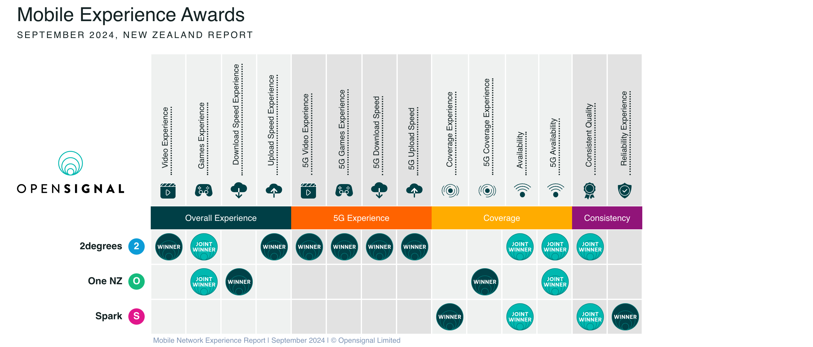

# 📱 手机卡

## 新西兰的手机卡办理指南

刚到新西兰，第一件事之一就是搞定手机卡！毕竟，没有手机网络，连 Google Maps 都用不了，联系房东、找工作、接收银行验证码都成问题。那在新西兰如何选择合适的手机套餐？有哪些运营商？本文带你快速上手！  

---

## 🔍 新西兰的手机套餐

新西兰的手机套餐主要分为 **Prepay（预付费）** 和 **Pay Monthly（后付费）** 两种模式。  

### 💰 Prepay（预付费）

适合短期停留或预算有限的人群，特点如下：  
✅ 先充值、后消费，花多少充多少，控制成本简单  
✅ 无需签合同，可随时更换或停用  
✅ 通常提供“自动充值”（Auto Top-up）功能，防止欠费停机  

适合人群：留学生、短期旅客、打工度假签（WHV）人士  

### 🏦 Pay Monthly（后付费）

适合长期居住、流量需求大的用户，特点如下：  
✅ 每月固定账单，不用担心余额不足  
✅ 通常包含无限通话、短信，有些套餐提供国际通话优惠  
✅ 可能有合约（12 个月或 24 个月），违约可能需要支付取消费用  

适合人群：工作人士、家庭用户、大流量用户  

---

## 📡 新西兰主要运营商对比  

新西兰主要有三大运营商：**Spark**、**2degrees** 和 **One NZ（原 Vodafone）**，它们提供自己的网络覆盖，并允许其他小品牌使用它们的网络服务。  

| 运营商   | 优势 | 劣势 | 适合人群 |
|----------|------|------|--------|
| **Spark** | 4G/5G 覆盖广，提供公共 WiFi（Spark WiFi 热点） | 价格较贵，流量限制较严格 | 需要稳定信号、经常出入公共场所的用户 |
| **2degrees** | 性价比高，Unlimited 计划较便宜，2024年网络体验最佳（Opensignal 评测） | 信号覆盖稍逊于 Spark，偏远地区可能较弱 | 大流量用户，留学生，性价比党 |
| **One NZ（原 Vodafone）** | 国际漫游套餐多，适合经常旅行的人 | 客服评价一般，部分地区信号不稳定 | 经常出国、国际通话需求多的用户 |

**📊 2024 年网络表现最佳**  
根据 **Opensignal 2024 报告**，2degrees 在多个网络体验指标上获得最高评分，表现优于 Spark 和 One NZ。📈 [详细报告看这里](https://www.opensignal.com/reports/2024/09/newzealand/mobile-network-experience)  

---

## 🔄 其他运营商选择  

除了三大运营商外，还有一些 **小型虚拟运营商（MVNO）**，它们通常租用大运营商的网络，但价格更便宜。例如：  

### 📦 Kogan Mobile（使用 One NZ 网络）

💲 **套餐便宜**：35 纽币/月 包含 **15GB** 流量（比大运营商划算）  
🚚 **SIM 卡寄送**：需等待几天寄到新西兰地址  
💳 **付款方式有限**：需 **PayPal** 或 **新西兰银行卡**（无实体店可充值）  
💡 **适合人群**：预算有限、习惯在线购买服务的用户  

---

## 📜 办理手机卡的步骤  

1️⃣ **选择运营商和套餐**：决定是 Prepay 还是 Pay Monthly，并对比不同的 plan  
2️⃣ **准备身份证明**：一般需要护照或驾照（Pay Monthly 可能需要额外的地址证明）  
3️⃣ **获取 SIM 卡**：

    - 线下：机场、超市、运营商门店（推荐 Spark、2degrees、One NZ 门店）  
    - 线上：官网订购（Kogan 需邮寄）

4️⃣ **激活 SIM 卡**：插入手机，按照短信或运营商 APP 指示操作  

💡 **小贴士**：

- 机场买 SIM 卡通常更贵，推荐到市区门店购买  
- 如果是短期停留，建议选 Prepay，无需合同约束  
- 需要国际电话？选择带国际分钟数的 plan，或使用微信/Skype 等网络电话  
